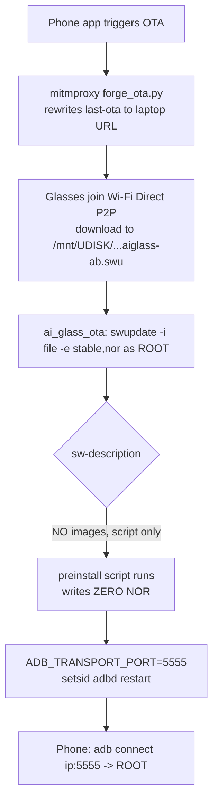

# Cyan V821 — Software-Only Ownership Plan (No Hardware, No USB)

> **Provenance:** synthesized by a 10-agent workflow (`software-only-ownership-paths`, run `wf_9f79a97c-d0c`, 2026-07-27), adversarially verified. Depends on the flash-halt root cause in [`../05_Hardware_Hacking_Findings/swu_flash_halt_root_cause.md`](../05_Hardware_Hacking_Findings/swu_flash_halt_root_cause.md). Every unverified step below **fails non-destructively** — no partition is written unless explicitly stated.

**Status:** definitive synthesis · **Boot media:** NOR-by-design · **Delivery channel:** forged `.swu` over Wi-Fi Direct P2P (already working) · **Brick risk:** LOW (safe by construction)

---

## 1. Goal & Hard Constraints

Total ownership (root shell + persistence) of the Cyan glasses (Allwinner V821, Tina/OpenWrt Linux) using **software only**.

| Constraint | Rule |
|---|---|
| Hardware | NONE — no teardown, no UART, no CH341A |
| USB | NONE — no USB data connection at all |
| Delivery | Reuse the proven path: forge/serve a custom `.swu`; `ai_glass_ota` runs `swupdate -i <file>.swu -e stable,nor` as root |
| Absolute prohibition | The `.swu` must contain **NO image targeting the NOR die** (mtd0/3/4/5) |

---

## 2. The Known Blocker (root-caused, confidence 88)

The running root is a **squashfs demand-paged from mtdblock5** on the single **PY25Q256 NOR die**. `swupdate` erasing that die (kernel→mtd3 first) suspends reads on the whole chip, the NOR-paged userspace (swupdate/glibc/ai_glass_ota) page-faults on the first erase, and the SoC **livelocks at ~29%**. Any custom `.swu` that writes a NOR image self-contends and hangs **before any postinstall runs**. This is the vendor's own latent bug — `erase_sdnand_boot0()` guarantees the field device is always NOR-booted, so the vendor's own `-e stable,nor` field OTA is also broken.

**Corollary:** ownership must avoid the NOR die entirely and either (a) write nothing, or (b) write only the **separate SD-NAND die** (`mmcblk0`), which reads-while-writing and does not contend.

---

## 3. Best Path — NOR-Free Script `.swu` (adb-over-TCP)

Deliver a forged `.swu` whose `stable.nor` group has **NO `images:` list** and carries a single root **shell script** (PREINSTALL primary + postinstall backup). The script writes **no block device**: it flips stock `adbd` into TCP mode (:5555), activates it immediately via `setsid` (no reboot), and installs reboot persistence. Then `adb connect <glasses-ip>:5555` from the phone → root shell.



**Why PREINSTALL primary:** if `swupdate` runs preinstall then aborts an images-empty section on `Found nothing to install` before reaching postinstall, a postinstall-only payload runs nothing. Preinstall runs earliest; keep a postinstall duplicate as insurance and mirror the script into the `sdnand` group (the phone's *ota boot media* param, not the URL, selects `-e stable,nor` vs `stable,sdnand`).

---

## 4. Minimal `sw-description`

**Primary (script-only, zero writes):**

```
software = {
    version = "0.1.0";
    description = "owner tools";
    stable = {
        nor = {
            /* NO images: -> zero NOR/mtd writes -> no self-flash contention */
            scripts: (
                { filename = "postinstall_backdoor.sh"; type = "preinstall";  },
                { filename = "postinstall_backdoor.sh"; type = "postinstall"; }
            );
            bootenv: ( { name = "swu_mode"; value = ""; } );
            /* NEVER swu_next=reboot / boot_partition=recovery / swu_mode=recovery */
        };
        sdnand = {
            scripts: (
                { filename = "postinstall_backdoor.sh"; type = "preinstall";  },
                { filename = "postinstall_backdoor.sh"; type = "postinstall"; }
            );
            bootenv: ( { name = "swu_mode"; value = ""; } );
        };
    };
    bootenv: (
        { name = "swu_param"; value = ""; }, { name = "swu_software"; value = ""; },
        { name = "swu_mode"; value = ""; },  { name = "swu_version"; value = ""; }
    );
}
```

**Guaranteed-valid fallback (one tiny SD-NAND image, still zero NOR):**

```
nor = {
    images: ( { filename = "carrier"; device = "/dev/mmcblk0p14"; installed-directly = true; } );
    scripts: ( { filename = "postinstall_backdoor.sh"; type = "preinstall"; },
               { filename = "postinstall_backdoor.sh"; type = "postinstall"; } );
    bootenv: ( { name = "swu_mode"; value = ""; } );
}
```

**CPIO (newc `070701`) member order:** `sw-description` FIRST → `postinstall_backdoor.sh` → `cpio_item_md5` (add `carrier` md5 in fallback) → `TRAILER!!!`.

**Forbidden in the forged file:**

| Never include | Why |
|---|---|
| `device = "/dev/mtd*"`, boot0/kernel/rootfs/riscv images | NOR self-flash contention → brick |
| `hardware-compatibility` list | Would newly enable board rejection (stock has none, /etc/hwrevision absent) |
| `encrypted = true` | AES backend absent (no libcrypto in rootfs) → abort |
| `swu_next = "reboot"` | Reboot-loop / boot diversion |

**What IS enforced by swupdate:** cpio newc CRC `check` field + `sw-description`-must-be-first ordering (+ per-image sha256/md5 if declared). There is **no cryptographic signature** — the ELF has no `.sig/RSA/CMS/X509/publickey` strings, no libcrypto dependency, and `ai_glass_ota` invokes it with no `-k`. Anti-rollback (`-N/-R`) is not passed and `/etc/sw-versions` is absent, so any version installs.

---

## 5. The Safe-Script Contract

Adopt `hardware_research/ghidra_analysis/postinstall_backdoor.sh` verbatim as the template.

```sh
#!/bin/sh
# writes NO partitions, idempotent, ALWAYS exit 0
PATH=/usr/sbin:/usr/bin:/sbin:/bin; export PATH
PORT=5555
# (1) patch stock adbd to TCP mode (grep-guarded, idempotent)
# (2) write /etc/init.d/S99zbackdoor  (rc.final runs it every boot, every mode)
# (3) crond watchdog in /etc/crontabs/root (respawns TCP adbd)
# (4) immediate no-reboot activation:
setsid sh -c "ADB_TRANSPORT_PORT=$PORT /etc/init.d/adbd restart" </dev/null >/dev/null 2>&1 &
exit 0
```

| Rule | Rationale |
|---|---|
| No `dd`, `mkfs.*`, `> /dev/mtd*`, `> /dev/mmcblk*`, `ubiupdatevol` | Zero block writes → no contention |
| No `/sys/class/sunxi_dump/write` | That is the vendor's raw gprcm boot-source poke — exclude it |
| No `switch_root`, no `fw_setenv` of swu_next/boot_partition/swu_mode | Boot-diversion wedge (independent of NOR contention) |
| Never destructively edit inittab / rcS / rc.final / load_script.conf | A mountable-but-corrupt /etc bypasses the self-heal (the one residual soft-brick) — append a guarded new hook only |
| Anchor writables under `/mnt/UDISK` (SD-NAND, mmcblk0p15) | Confirmed writable, never NOR; keep the log rotated |
| `setsid` for activation | Survives swupdate exit; no reboot |
| `sh -n` + shellcheck + grep-assert + `cpio -itv` before shipping | Prove no `dd`/`mkfs`/`> /dev/`/`sunxi_dump`/`switch_root`/`swu_next` |

---

## 6. Reachability — Connect With No USB

`adb`-over-TCP :5555 is the **only** network shell endpoint (no telnetd/dropbear/sshd/httpd in the rootfs; busybox has only the crond applet).

### Route 1 — Immediate (during the live OTA, no reboot)
The `.swu` is delivered in aglink mode 3, so wlan/P2P is already up. The script does `setsid sh -c 'ADB_TRANSPORT_PORT=5555 /etc/init.d/adbd restart'`. The adb host **must be a P2P group member = the PHONE** (rooted Android/Termux) — a PC is not on the P2P link.

| Group Owner | Glasses IP | Discover |
|---|---|---|
| Glasses = GO | `192.168.6.1` | dnsmasq.conf listen-address on p2p-wlan0-0 |
| Phone = GO | `192.168.49.x` | `ip neigh show dev p2p-wlan0-0`, or reuse the peer IP the app served the .swu to |

`adb connect <ip>:5555 && adb shell` → root (selinux=0, adbd runs as root).

### Route 2 — Persistent, PC-reachable (defeats on-demand Wi-Fi)
**Blocker:** `/etc/media/rtc_init.sh` loads wlan only for aglink modes 2/3/8. After a normal reboot in other modes there is no interface. **Fix:** `/etc/init.d/S99zbackdoor` (rc.final runs every `S??*` 'start' unconditionally, every mode):

```sh
[ "$1" = start ] || exit 0
# gate: only when NOT in app P2P/OTA/livestream modes
insmod /mnt/UDISK/data/lib/modules/$(uname -r)/v821_fmac.ko 2>/dev/null \
  || insmod /mnt/UDISK/data/lib/modules/$(uname -r)/v821_smac.ko 2>/dev/null
wifi_daemon & sleep 3; wifi -o sta
wifi -o connect '<HOME_SSID>' '<HOME_PSK>'      # fallback: wpa_supplicant.conf + wpa_cli
/etc/init.d/udhcpc_wlan0 start
ADB_TRANSPORT_PORT=5555 /etc/init.d/adbd restart
```

Glasses become a normal STA. Discover from any PC as host **`TinaLinux`** in the router DHCP table or `nmap -p5555 <subnet>`, then `adb connect <lan-ip>:5555`.

> Persistence sticks because `/etc` is an overlay upperdir (small fs transactions, not a die-erase) and `/mnt/UDISK` is writable ext4 on SD-NAND — neither triggers NOR contention.

---

## 7. Brick Safety

**Safe by construction; risk LOW, not mathematically zero.**

- No NOR image → no erase of the demand-paged die → the contention mechanism cannot fire.
- SD-NAND fallback writes only `mmcblk0` (separate managed die, reads-while-writes).
- `swu_next=reboot` is commented out in BOTH groups → a failed swupdate just logs `ota failure!` and keeps running current firmware; it cannot wedge boot.
- Self-heal: if the overlay upperdir (rootfs_data) fails to MOUNT, `/init` runs `mkfs_jffs2` and boots to pristine defaults on the next power cycle.
- The probe's failure mode (`Found nothing to install`) writes nothing.

**Residual soft-brick (the one case needing hardware):** if `/etc` mounts but contains boot-breaking content, the mount-failure self-heal does not fire. Prevented by never editing boot-critical files.

**Recovery playbook:** (a) power-cycle first (auto-heals an unmountable overlay); (b) with a shell, `fw_setenv parts_clean rootfs_data:UDISK && reboot` for a full software factory reset; (c) only a corrupt-but-mountable `/etc` with dead adb needs hardware.

---

## 8. Why the `switch_root` Block Is Commented Out (Resolved)

The `switch to sdnand rootfsA (switch_root mmcblk0p9)` + `destroy nor boot0 (dd zero mtdblock0)` block in `preinstall_nor.sh` is **bundled factory/efex conversion tooling, not a safe-OTA pivot**:

1. `switch_root` replaces init and never returns — a preinstall script that exec'd it could never continue to write images or reach `return 0`.
2. It dd-zeroes NOR boot0, making NOR **unbootable** — the opposite of what the `nor` group (reflash NOR, keep booting NOR) wants.

It is the mirror of `erase_sdnand_boot0()`: the factory path erases SD-NAND boot0 to force **permanent NOR boot**; this block would force SD-NAND boot. Left inline and commented alongside the also-commented `swu_next=reboot` and `awuboot` line — the whole `nor` recipe is a half-finished, factory-oriented artifact. The intended safe field-OTA (pivot the running root onto SD-NAND before erasing NOR) was never made returnable and shipped disabled. **Never re-enable this block; never set `swu_next=reboot`.**

---

## 9. Ranked Alternatives

| # | Vector | Feasibility | Beats chosen path? | Note |
|---|---|---|---|---|
| 1 | **Script-only NOR-free `.swu`** | High | — (chosen) | Zero NOR; worst case is non-destructive |
| 2 | SD-NAND-carrier `.swu` (mmcblk0p14 + script) | High | fallback | Removes the empty-section unknown; still zero NOR |
| 3 | `LD_LIBRARY_PATH` `.so` hijack via `/mnt/UDISK/lib` | High | as PERSISTENCE only | Root code-exec every boot; not an independent bootstrap |
| 4 | Lua `embedded-script` in sw-description | High | packaging alt | In-process, smaller, no separate CPIO file/md5 |
| 5 | adbd-over-TCP shell | High | downstream | The deliverable shell; needs the script to flip it |
| 6 | BLE opcode 0xFC (writeIpToSoc) | Medium | no | Front door of the .swu channel; fixed swupdate string, no injection |
| 7 | aglink IPC / aglink_mode | Low | no | Only selects which binary launches |
| 8 | OTA-URL command injection | Low | no | Fixed literal, fixed path, no shell |
| 9 | Own JL7018 BLE MCU | Low | no | Same opcode surface; encrypted .bin; indirect |
| 10 | Swupdate-free /mnt/UDISK autorun | Low | no | **Negative result** — no boot-time exec of UDISK scripts exists |

---

## 10. Residual Risks & Open Questions

**Risks:** scripts-only acceptance unverified (fails safely); adbd TCP bind unverified + the `[ -n $ADB_TRANSPORT_PORT ]` test is unquoted/buggy; Wi-Fi is on-demand (modes 2/3/8 only); Route 2 CLI details inferred from strings; residual soft-brick from bad `/etc`; SD-NAND fallback overwrites idle user-B; possible (unconfirmed) whole-file integrity gate; ~5s download truncation; crond needs a written crontab.

**Open questions (on-device gates, resolved by the first shell):**
1. Does swupdate run a group's scripts when `images:` is empty?
2. Does adbd bind `0.0.0.0:5555` when `ADB_TRANSPORT_PORT` is set?
3. Is the glasses the P2P GO (192.168.6.1) or client (192.168.49.x)?
4. Exact `wifi -o connect` arg order and wlan `.ko` filename.
5. Any whole-file `.swu` md5/fileSize gate in the SDK / ai_glass_ota?
6. Which init runs (overlay self-heal vs direct `/etc`)? Where does rootfs_data live?
7. Exact lib names the ai_glass_* daemons dlopen (for the `.so` persistence).

> Every remaining unknown **fails non-destructively** — no partition is written. Try script-only first as a probe; escalate to the SD-NAND-carrier fallback only if `adb connect` fails.
