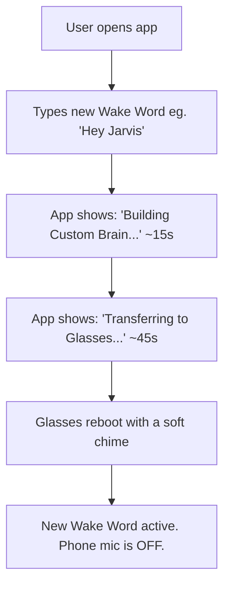
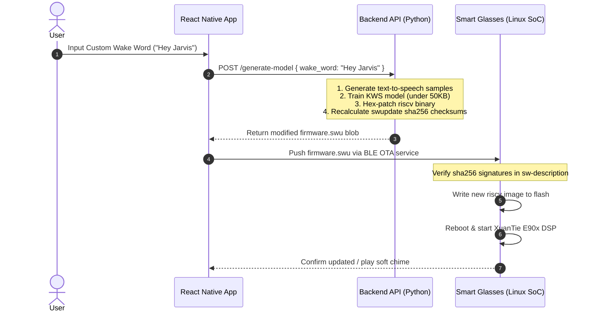

# Cloud-OTA Custom Wake Word: Product & Technical Implementation Plan

> ## ⚠️ WITHDRAWN (2026-07-27) — targets a firmware-resident model that does not exist
> This whole plan assumes the "Hey Cyan" model lives in the **RISC-V/E907 `riscv` binary** and can be
> **hex-patched + re-OTA'd** to change the phrase. That premise is **refuted**: the `riscv` image has no
> TFLM model (those regions are camera ISP LUTs), the wake word is not in any decrypted variant's
> flashable firmware, and `.swu` in-place OTA **halts** anyway (NOR self-flash contention). Two further
> inaccuracies below: the `.swu` moves over **Wi-Fi-Direct P2P HTTP**, not BLE (BLE-DFU is only for the
> `.bin`); and swupdate uses **md5**, not sha256 signatures (there is no code-signing). The realistic
> custom-wake-word path is a **phone-side recognizer**. Kept for history. Current state:
> `status_ledger_and_options.md`.

This document details the architecture, user experience, and technical implementation steps for deploying custom wake words on the "Hey Cyan" smart glasses using the **Cloud-OTA (Over-The-Air) Firmware Patching** technique.

It is split into two sections:
1. **Product & User Flow** (for Product Managers and UX designers)
2. **Technical Architecture & Backend Flow** (for Backend and Firmware engineers)

---

## Part 1: Product & User Flow (For Product Managers)

### High-Level Value Proposition
Instead of forcing the user's phone to listen continuously (which drains phone battery and raises massive privacy alarms with "always-on microphone" warnings), we process keyword detection entirely on the glasses' low-power RISC-V hardware coprocessor. 

By automating the firmware-flashing process behind the scenes, we give users the ability to change their wake word dynamically from the companion app without needing complex hardware modifications.

### The User Experience (UX) Flow



1. **Customization Page**: Inside the companion app's settings, the user goes to the "Wake Word Settings" panel.
2. **Input Word**: The user types in their preferred word (e.g. *"Hey Jarvis"*).
3. **Generation Progress**: The app displays a friendly loading screen: *"Generating acoustic model... (approx. 15 seconds)"*.
4. **Flashing Progress**: The app displays: *"Syncing with glasses... Please keep them close (approx. 45 seconds)"*.
5. **Completion & Reboot**: The glasses play a soft chime, indicating a quick reboot. The custom wake word is now live.

### Product Trade-offs & Limitations

| Trade-off | Option B (Phone-Based Continuous Mic) | Option A+ (Cloud-OTA Flashing) |
| :--- | :--- | :--- |
| **Privacy Rating** | 🔴 **Low** (continuous OS mic alerts) | 🟢 **High** (completely offline on-device) |
| **Battery Life Impact**| 🔴 **High** (drains phone & glasses) | 🟢 **None** (uses ultra-low-power hardware coprocessor) |
| **Change Frequency** | ⚡ **Instant** (under 1 second) | ⏱️ **Delayed** (approx. 60 seconds setup time) |
| **Network Required** | ❌ No (runs fully offline) | 🌐 Yes (only when *changing* the wake word) |

---

## Part 2: Technical Architecture & Backend Flow (For Developers)

The implementation relies on three components cooperating: the **Companion App (React Native)**, the **Acoustic Model Generator (Backend Cloud API)**, and the **Smart Glasses Firmware (`swupdate`)**.

### System Sequence Diagram



### Technical Step-by-Step Backend Specifications

#### Step 1: Automated Model Generation (Backend API)
When the backend receives the new wake word string, it must programmatically train a tiny keyword spotting model:
1. **Dataset Generation**: Use a Text-To-Speech (TTS) engine (like Coqui TTS or Bark) with multiple distinct voice profiles to generate ~500 audio samples of the chosen phrase. Include background noise overlays (fan noise, street hum, office chatter) to prevent false positives.
2. **Model Training**: Run a headless training script (e.g. TensorFlow/Keras) targeting a highly optimized Keyword Spotting (KWS) model. The model must compile to a standard TensorFlow Lite for Microcontrollers (TFLite Micro) flatbuffer.
3. **Memory Restriction Constraint**: The output `.tflite` model file **must be strictly under 50KB** to fit inside the dedicated `.rodata` segment allocation of the RISC-V binary, and must not exceed the coprocessor's 57KB `.bss_unsaved` tensor arena limit.

#### Step 2: Binary Overwriting & Patching
The backend does not rebuild the entire firmware from source. Instead, it hex-patches the existing binary:
1. **Find Target Address**: The cloud server holds a copy of the base `riscv` ELF binary. We will isolate the exact memory offset (e.g., `0x808xxxxx`) where the hardcoded "Hey Cyan" weights sit.
2. **Inject Model**: The script overwrites those exact bytes with the newly generated `.tflite` byte array. 
3. **Pad Remainder**: The remainder of the original allocation space is padded with null bytes (`0x00`). **Crucial**: No offsets or sections are shifted, preventing binary corruption.

#### Step 3: `swupdate` Re-Packaging & MD5 Updates
The smart glasses use `swupdate` to apply OTA packages (`firmware.swu` is a CPIO archive). The glasses will reject any archive whose MD5 checksums do not match the binary payloads:
1. **Extract Metadata**: The backend reads `sw-description` and the MD5 list from the base `firmware.swu` CPIO archive.
2. **MD5 Calculation**: Calculate the MD5 checksum of the newly patched `riscv` binary file.
3. **Update MD5 List**: Modify `cpio_item_md5` to reflect the new MD5 hash of the patched `riscv` binary.
4. **Compile CPIO Archive**: Package the `sw-description`, the updated `cpio_item_md5`, and the patched `riscv` binary back into a single `firmware.swu` CPIO file.

#### Step 4: OTA Transfer Protocol (App to Glasses)
The React Native app handles pushing the package to the glasses over Bluetooth:
1. **BLE Write**: The app chunk-transfers the `firmware.swu` byte stream to the glasses' custom OTA BLE characteristic.
2. **Install Command**: The Linux core receives the chunks, writes them to `/tmp/update.swu`, and runs the standard installation:
   ```bash
   swupdate -i /tmp/update.swu
   ```
3. **Hash Check & Fallback**: If the update is corrupt or interrupted, `swupdate`'s dual-copy fallback system (A/B booting) will automatically revert the glasses to the previous working firmware, eliminating any bricking risk.
   > ⚠️ **REFUTED (2026-07-27):** A/B rollback is **UNVERIFIED** and the `nor` rootfs target **is** the mounted `mtdblock5`. An interrupted/contended `-e stable,nor` flash does **not** safely revert — it wedges the SoC (29%, b4=0, LED on) or corrupts the live root (55%). Do **not** present in-place NOR OTA as brick-safe. (This whole plan doc is also stale: it assumes BLE-chunk `.swu` transfer and a RISC-V-coprocessor wake word, both superseded.)
4. **Coprocessor Reset**: Once successfully verified and flashed, the main Linux core resets the RISC-V coprocessor pin to load the new wake word into the DSP.

---

## 3. Immediate Developer Next Steps

To make this plan actionable, developers must complete the following investigations:

1. **Locate the Model Offset**: We must locate the exact starting address and size limit of the acoustic model array inside the `riscv` binary.
2. **Verify swupdate Capabilities**: We verified that `sw-description` does not use cryptographic signatures or SHA256 hashes; only plaintext MD5 verification is enforced via `cpio_item_md5`. This makes repackaging simpler than initially estimated.
